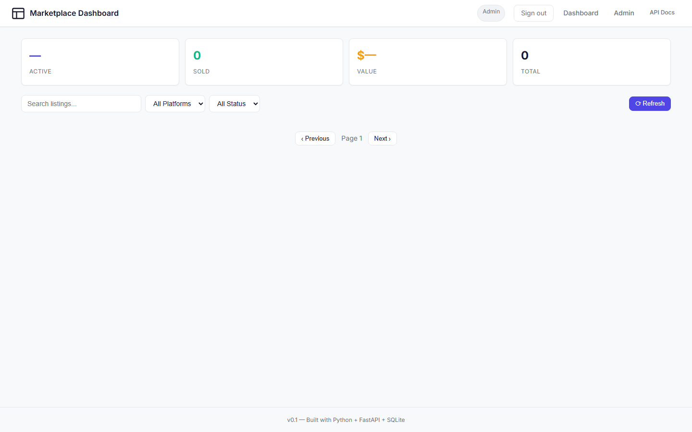

# Marketplace Dashboard

A self-hosted dashboard for your eBay and Etsy shops: live listings, sales
stats, and shared inventory — with **Google Sign-In** and **Teams** so
multiple people can manage the same stock from their own accounts.

Built with FastAPI + SQLite (no database server to maintain) and a plugin
system for extra features.



## Quick start (one click, Windows)

1. Keep **start-marketplace-dashboard.bat** on your Desktop.
2. Double-click it. It finds Python, creates the virtual environment,
   installs dependencies, and starts the server — all on its own.
3. Open **http://localhost:8000** in your browser.
4. Log in as `admin` / `changeme123`, then change the password in
   **Admin → Settings**.

The launcher stays on the Desktop; the project itself lives in
`%USERPROFILE%\Projects\marketplace-dashboard`.

Prefer the command line or Docker? See [docs/SETUP.md](docs/SETUP.md).

## Features

- **Multi-marketplace** — eBay (Selling API v2) and Etsy (Open API v3) via official APIs, sync on demand or on a schedule. Configure credentials right in the Admin page.
- **Dark / Light Theme** — Built-in theme switcher with automatic system preference detection (`prefers-color-scheme`) and persistence.
- **Interactive Listing Details** — Modal dialog displaying full high-res images, pricing, available quantity, SKU, live links, and quick team reassignment.
- **Google Sign-In** — One-click OAuth login with a Google account ([docs/GOOGLE-LOGIN.md](docs/GOOGLE-LOGIN.md)).
- **Teams** — Multiple users share one inventory; personal stock stays separate. Team switcher on the dashboard, team management in Admin ([docs/TEAMS.md](docs/TEAMS.md)).
- **Dashboard** — Listings from every connected shop, per-team stock counts, aggregated valuation stats, price alerts, and responsive grid.
- **Admin page** — Interactive settings for API keys, marketplace accounts, users, teams, and plugins.
- **Plugin system** — Drop a `.py` file into `plugins/` to add features ([docs/PLUGINS.md](docs/PLUGINS.md)).
- **CI / Automated Testing** — Fast, in-process automated integration tests and GitHub Actions CI workflow.

## Tech stack

| Layer | Technology |
|---|---|
| Backend | Python 3.11+ / FastAPI + Uvicorn |
| Database | SQLite (SQLAlchemy ORM) — single file, zero config |
| Frontend | Modern Vanilla HTML5 + CSS3 + JS (no build step) |
| Templating | Jinja2 |
| CI/CD | GitHub Actions |
| Deployment | Direct on Windows, or Docker + Nginx |

## Documentation

| Document | What it covers |
|---|---|
| [docs/SETUP.md](docs/SETUP.md) | Install (one-click, manual, Docker), marketplace credentials, troubleshooting |
| [docs/CONFIGURATION.md](docs/CONFIGURATION.md) | Every `.env` key and admin-page setting |
| [docs/GOOGLE-LOGIN.md](docs/GOOGLE-LOGIN.md) | Creating the Google OAuth client, step by step |
| [docs/TEAMS.md](docs/TEAMS.md) | How Teams work — user guide |
| [docs/SECURITY.md](docs/SECURITY.md) | Security model, OWASP Top 10 mapping |
| [docs/API.md](docs/API.md) | REST API reference |
| [docs/ARCHITECTURE.md](docs/ARCHITECTURE.md) | Code layout, for contributors |
| [docs/PLUGINS.md](docs/PLUGINS.md) | Writing and testing plugins |

## Tests

```bash
python tests/test_ui_wiring.py       # static: JS getElementById vs HTML ids
python -m unittest tests/test_api_client.py  # automated in-process API test suite
python tests/test_teams.py           # API end-to-end (server must be running)
node tests/ui_smoke_test.js          # real-browser UI smoke test (needs Node)
```

## Project layout

```
marketplace-dashboard/
├── README.md · requirements.txt · .env.example
├── Dockerfile · docker-compose.yml · nginx/
├── src/
│   ├── api/          # FastAPI app + all routes (one readable file)
│   ├── adapters/     # base.py + ebay.py + etsy.py
│   ├── plugins/      # plugin loader
│   ├── config.py     # .env loading
│   ├── database.py   # SQLAlchemy setup
│   └── models.py     # all database tables
├── static/           # css/ + js/ (vanilla JS)
├── templates/        # Jinja2 pages: login, dashboard, admin
├── plugins/          # your plugins live here (price_alerts.py included)
├── tests/            # test scripts (see above)
└── docs/             # this documentation
```

## License

MIT
