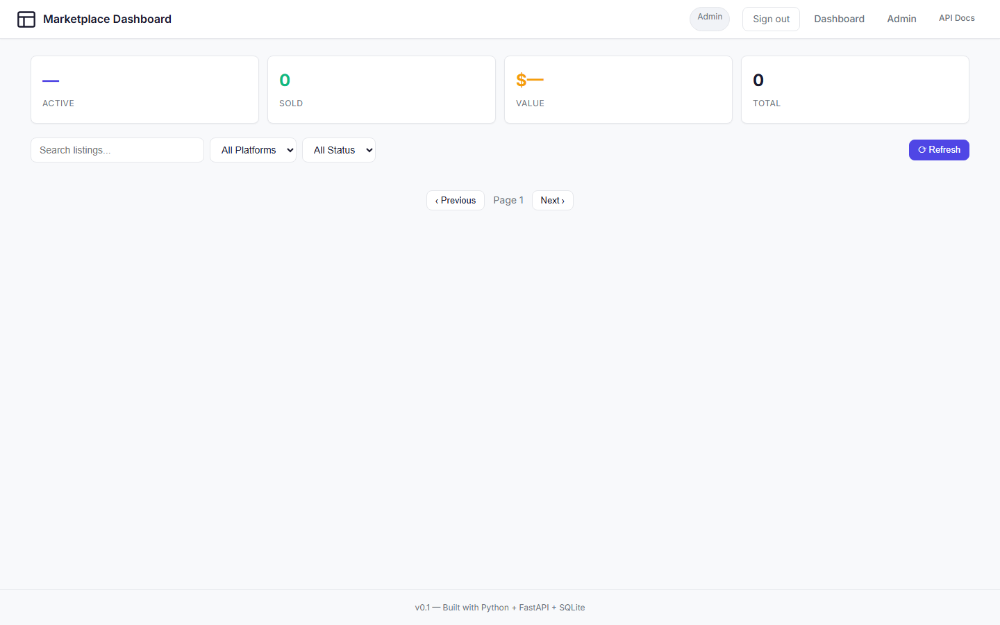

# Marketplace Dashboard

A self-hosted dashboard for your eBay and Etsy shops: live listings, sales
stats, and shared inventory — with **Google Sign-In** and **Teams** so
multiple people can manage the same stock from their own accounts.

Built with FastAPI + SQLite (no database server to maintain) and a plugin
system for extra features.



## Accounts and teams

People can join in two ways, and **neither one puts them into someone else's
inventory**:

- **Sign in with Google** — one click, no password to manage.
- **Sign up with email + password** — at `/signup`. This one sends a
  confirmation link and **no account exists until it is clicked** (see
  *Outbound email* below).

Either way a brand-new account has **no team**. It lands on **`/onboarding`**
and chooses between:

1. **Create my own workspace** — a private team it owns outright.
2. **Ask to join a team** — enter the *email address of the person who runs
   the team*, plus a short note. The owner approves or declines under
   **Admin → Join Requests**. Team names are never disclosed to the requester.

A shared invite link (Admin → Teams) skips the chooser and joins that team
directly.

### Outbound email (required for email signup)

Email signup cannot complete without working outbound email, because the
account is only created when the confirmation link is opened. Configure it
in **Admin → Outbound Email**, then use **Send test email** to prove
delivery. Verification links are single-use and expire after 60 minutes.

Two transports are supported — pick whichever suits you:

**Provider API (recommended).** `MAIL_BACKEND=http`, then set
`MAIL_PROVIDER` to `resend`, `brevo`, `postmark`, or `generic` (a plain JSON
endpoint), plus `MAIL_API_KEY`.

**SMTP.** `MAIL_BACKEND=smtp` with `SMTP_HOST` / `SMTP_USER` /
`SMTP_PASSWORD`.

Either way set `MAIL_FROM` to an address on **a domain you own and have
verified with your provider** — for example
`noreply@mail.yourdomain.com`. Verification requires three DNS records (SPF,
DKIM, DMARC) which your provider generates for you. Do not use a personal
mailbox as the sender: it will be rewritten or rejected, and it exposes your
address to every recipient. A subdomain such as `mail.yourdomain.com` keeps
sending reputation separate from your main domain.

## Quick start (one click, Windows)

1. Keep **start-marketplace-dashboard.bat** on your Desktop.
2. Double-click it. It finds Python, creates the virtual environment,
   installs dependencies, and starts the server — all on its own.
3. Open **http://localhost:8000** in your browser.
4. Log in as `admin` / `changeme123`, then change the password in
   **Admin → Settings**.

The launcher stays on the Desktop; the project itself lives in
`%USERPROFILE%\Projects\marketplace-dashboard`.

Prefer the command line or Docker? See [docs/SETUP.md](docs/SETUP.md).

## Features

- **Multi-marketplace** — eBay (Selling API v2) and Etsy (Open API v3) via official APIs, sync on demand or on a schedule. Configure credentials right in the Admin page.
- **Dark / Light Theme** — Built-in theme switcher with automatic system preference detection (`prefers-color-scheme`) and persistence.
- **Interactive Listing Details** — Modal dialog displaying full high-res images, pricing, available quantity, SKU, live links, and quick team reassignment.
- **Google Sign-In** — One-click OAuth login with a Google account ([docs/GOOGLE-LOGIN.md](docs/GOOGLE-LOGIN.md)).
- **Teams** — Multiple users share one inventory; personal stock stays separate. Team switcher on the dashboard, team management in Admin ([docs/TEAMS.md](docs/TEAMS.md)).
- **Dashboard** — Listings from every connected shop, per-team stock counts, aggregated valuation stats, price alerts, and responsive grid.
- **Admin page** — Interactive settings for API keys, marketplace accounts, users, teams, and plugins.
- **Plugin system** — Drop a `.py` file into `plugins/` to add features ([docs/PLUGINS.md](docs/PLUGINS.md)).
- **CI / Automated Testing** — Fast, in-process automated integration tests and GitHub Actions CI workflow.

## Tech stack

| Layer | Technology |
|---|---|
| Backend | Python 3.11+ / FastAPI + Uvicorn |
| Database | SQLite (SQLAlchemy ORM) — single file, zero config |
| Frontend | Modern Vanilla HTML5 + CSS3 + JS (no build step) |
| Templating | Jinja2 |
| CI/CD | GitHub Actions |
| Deployment | Direct on Windows, or Docker + Nginx |

## Documentation

| Document | What it covers |
|---|---|
| [docs/SETUP.md](docs/SETUP.md) | Install (one-click, manual, Docker), marketplace credentials, troubleshooting |
| [docs/EMAIL.md](docs/EMAIL.md) | Outbound email: domain + DNS (SPF/DKIM/DMARC), providers, verification |
| [docs/DEPLOY.md](docs/DEPLOY.md) | Deploying: host choice, Cloudflare, uploads, rate limiting, backups |
| [terraform/README.md](terraform/README.md) | Rebuilding the infrastructure from scratch (Lightsail + Cloudflare Tunnel) |
| [docs/CONFIGURATION.md](docs/CONFIGURATION.md) | Every `.env` key and admin-page setting |
| [docs/GOOGLE-LOGIN.md](docs/GOOGLE-LOGIN.md) | Creating the Google OAuth client, step by step |
| [docs/TEAMS.md](docs/TEAMS.md) | How Teams work — user guide |
| [docs/SECURITY.md](docs/SECURITY.md) | Security model, OWASP Top 10 mapping |
| [docs/API.md](docs/API.md) | REST API reference |
| [docs/ARCHITECTURE.md](docs/ARCHITECTURE.md) | Code layout, for contributors |
| [docs/PLUGINS.md](docs/PLUGINS.md) | Writing and testing plugins |

## Tests

```bash
python tests/test_ui_wiring.py                    # static: JS getElementById vs HTML ids
python -m unittest tests.test_api_client          # in-process API + auth/onboarding suite
python -m unittest tests.test_email_verification  # signup confirmation: tokens, expiry, resends
python -m unittest tests.test_mailer_smtp         # real SMTP delivery + provider usage API
python -m unittest tests.test_google_callback     # Google callback routing (stubs Google HTTP)
python -m unittest tests.test_multitenancy        # tenant isolation: no cross-team leakage
python -m unittest tests.test_security_audit      # auth, RBAC and hardening checks
python -m unittest tests.test_rate_limiting       # limits persist across workers
python -m unittest tests.test_storage             # local + S3 image storage (stubbed S3)
python tests/test_teams.py                        # API end-to-end (server must be running)
node tests/ui_smoke_test.js                       # real-browser UI smoke test (needs Node)
```

The `unittest` suites accept a throwaway database, which is the safe way to
run them against a machine that has real data:

```bash
DATABASE_URL=sqlite:///./tmp-test.db python -m unittest tests.test_api_client
```

Without that override they write into `marketplace.db`.

## Project layout

```
marketplace-dashboard/
├── README.md · requirements.txt · .env.example
├── Dockerfile · docker-compose.yml · nginx/
├── src/
│   ├── api/          # FastAPI app + all routes (one readable file)
│   ├── adapters/     # base.py + ebay.py + etsy.py
│   ├── plugins/      # plugin loader
│   ├── config.py     # .env loading
│   ├── database.py   # SQLAlchemy setup
│   └── models.py     # all database tables
├── static/           # css/ + js/ (vanilla JS)
├── templates/        # Jinja2 pages: login, dashboard, admin
├── plugins/          # your plugins live here (price_alerts.py included)
├── tests/            # test scripts (see above)
└── docs/             # this documentation
```

## License

MIT
